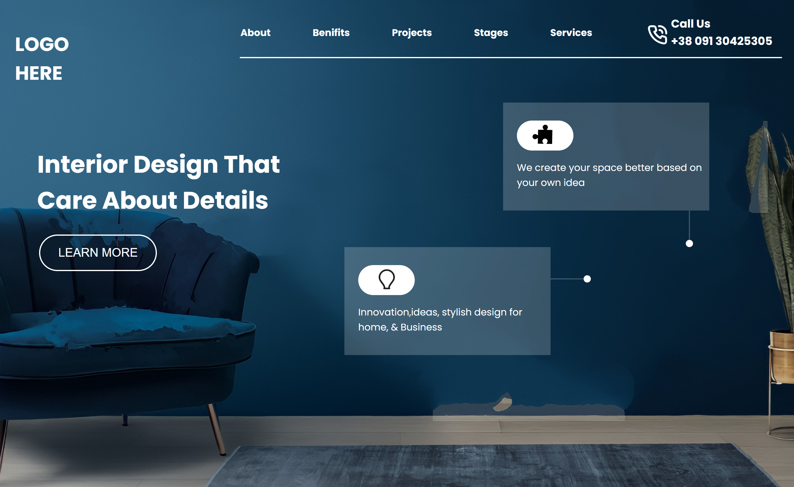
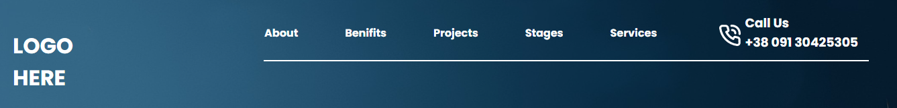
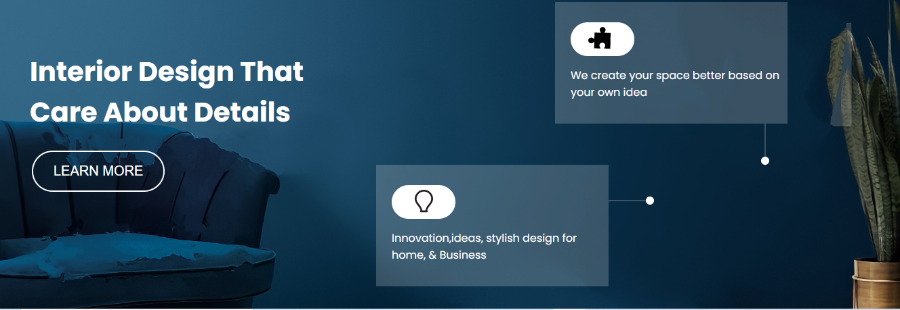

# Project No. 10

This is my _**10th project**_ of Web Development. The project is designed in such a way that it works on large(Desktop & Laptop) as well as small screens(Mobile Devices). 

> [Click the live link here](https://project-10-by-noman.vercel.app/)

FULL WEBPAGE:

NAVBAR:

BODY:

## Technologies Used

## What I leaned

- How to position Background images effectively in CSS.
- Working with color and gradients.
- Writing Media Queries.
- How to make a website responsive.
- How to make different shapes in CSS.
- Border Radius in CSS.

# Connect with me

   &ensp;
  &ensp;
  &ensp;
  
